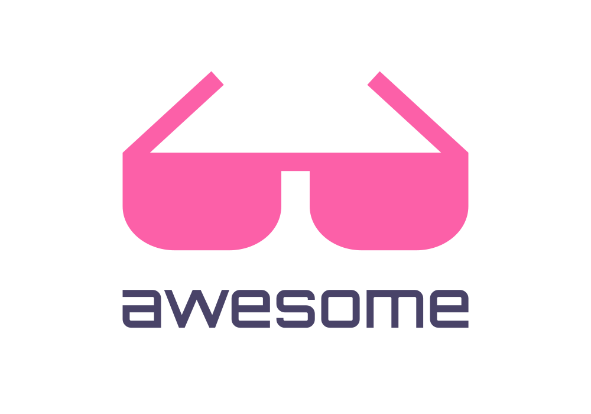

  

> 如果您想贡献新项目, 请遵循先来先排的顺序

> 标有 💰 的项目是收费软件

## 精选 LessCode 项目

- 整体解决方案

  - [orange-admin](https://gitee.com/orangeform/orange-admin): 橙单：70% 的微服务代码可视化生成  

  - [steedos-platform](https://github.com/steedos/steedos-platform/): 华炎魔方是开源低代码开发工具，基于商业智能和模型驱动，可以按照业务需求，轻松便捷地创建智能化、移动化、个性化的应用程序 💰  

  - [ToolJet](https://github.com/ToolJet/ToolJet)：Open-source low-code framework for building React-based web applications and internal tools 🚀  

  - [NocoBase](https://cn.nocobase.com/)：极易扩展的开源无代码开发平台  
  
- 前端

  - 框架:

    - [amis](https://github.com/baidu/amis): 前端低代码框架，通过 JSON 配置就能生成各种后台页面, 目前在百度大量用于内部平台的前端开发，已有 100+ 部门使用，创建了 1.2w+ 页面  

    - [ams](https://github.com/vipshop/ams): AMS 是基于 Vue.js 和 Element 组件库、通过 JSON 配置来快速搭建管理后台的一整套前端解决方案  

    - [mometa](https://github.com/imcuttle/mometa)：面向研发的低代码元编程，代码可视编辑，辅助编码工具  

  - H5:

    - [luban-h5](https://github.com/ly525/luban-h5): 鲁班 H5 是基于 Vue2.0 开发的，通过拖拽的形式，生成页面的工具，类似易企秀、百度 H5 等工具  
    
    - [gods-pen](https://github.com/ymm-tech/gods-pen):码良是一个在线生成 h5 页面并提供页面管理和页面编辑的平台，用于快速制作 H5 页面  

    - [h5-factory](https://github.com/yangyuji/h5-factory): h5 专题页面可视化编辑工具，拖拽编辑，灵活切换，一键生成 html 文件  

    - [h5-Dooring](https://github.com/MrXujiang/h5-Dooring): (H5 编辑器)H5-Dooring 是一款功能强大，开源免费的 H5 可视化页面配置解决方案，致力于提供一套简单方便、专业可靠、无限可能的 H5 落地页最佳实践。技术栈以 react 为主， 后台采用 nodejs 开发  

    - [tefact](https://github.com/staringos/tefact): 轻量级无代码/低代码 H5、表单编辑器  

    - [vite-vue3-lowcode](https://github.com/buqiyuan/vite-vue3-lowcode)：vue3.x + vite2.x + vant + element-plus H5移动端低代码平台 lowcode 可视化拖拽  

    - [ih5](http://www.ih5.cn/editor3): 专业的 H5 在线制作工具 💰

  - 表单设计器:

    - [avue 表单设计器](https://github.com/sscfaith/avue-form-design): 基于 avue 的超好用表单设计器, 你值得拥有   

    - [formily](https://github.com/alibaba/formily)：阿里巴巴集团统一表单解决方案  

    - [vue-form-making](https://github.com/GavinZhuLei/vue-form-making): 基于 vue 和 element-ui 实现的表单设计器，使用了最新的前端技术栈，内置了 i18n 国际化解决方案，可以让表单开发简单而高效  

    - [form-generator](https://github.com/JakHuang/form-generator): Element UI 表单设计及代码生成器，可将生成的代码直接运行在基于 Element 的 vue 项目中  

    - [vue Ant-Design](https://github.com/Kchengz/k-form-design)：基于 vue Ant-Design 的表单设计器，快速开发  

    - [Element-Pro-Crud](https://github.com/BoBoooooo/Element-Pro-Crud): LowCode平台,配套表单,表格设计器,一键Crud  

  - 设计器:

    - [grapesjs](https://github.com/artf/grapesjs): Free and Open source Web Builder Framework. Next generation tool for building templates without coding  

    - [antd-visual-editor](https://github.com/xinyu198736/antd-visual-editor): ant-design 组件库实时可视化编辑器  

    - [Web-Editor](https://github.com/bojue/Web-Editor): 基于 angular 的 web 编辑器  

    - [designable](https://github.com/alibaba/designable)：阿里出品，🧩 Make everything designable 🧩  

    - [wix](https://wix.com): 創建專業網站的絕佳平臺 💰

    - [ivx](https://www.ivx.cn/): 0 代码网页设计器 💰

  - AI + 前端
    - [imgcook](https://github.com/taofed/imgcook): 通过设计稿一键智能生成视图代码

    - [Screenshot-to-code](https://github.com/emilwallner/Screenshot-to-code): A neural network that transforms a design mock-up into a static website

- 后端
  - [node-red](https://github.com/node-red/node-red): Low-code programming for event-driven applications

  - [noflo](https://github.com/noflo/noflo): Flow-based programming for JavaScript

## 文章

- [可视化搭建工具技术探索之表单](https://juejin.cn/post/6969404225713340423)

...期待你的贡献 💃
