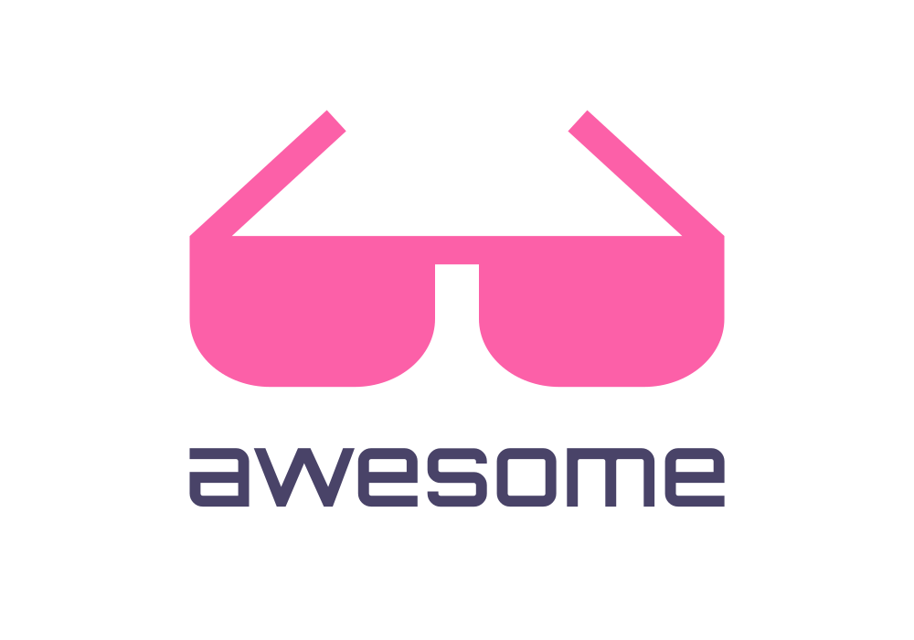

  

> 如果您想贡献新项目, 请遵循先来先排的顺序

> 标有 💰 的项目是收费软件

## 精选 LessCode 项目

- 整体解决方案

  - [orange-admin](https://gitee.com/orangeform/orange-admin): 橙单：70% 的微服务代码可视化生成  

  - [steedos-platform](https://github.com/steedos/steedos-platform/): 华炎魔方是开源低代码开发工具，基于商业智能和模型驱动，可以按照业务需求，轻松便捷地创建智能化、移动化、个性化的应用程序 💰  

  - [ToolJet](https://github.com/ToolJet/ToolJet)：Open-source low-code framework for building React-based web applications and internal tools 🚀  

  - [NocoBase](https://cn.nocobase.com/)：极易扩展的开源无代码开发平台  

  - [mall-cook](https://github.com/wangyuan389/mall-cook)：商城低代码平台，可视化搭建H5、小程序多端商城  

  - [openblocks](https://github.com/openblocks-dev/openblocks)：✨ The open-source Retool alternative  

  - [nocodb](https://github.com/nocodb/nocodb)：✨ The open-source Retool alternative  
  
  - [illa-builder](https://github.com/illacloud/illa-builder)：An open-source low-code Platform for Developers.  

  - [rowy](https://github.com/rowyio/rowy)：Rowy is an open-source low-code platform. Airtable-like UI for managing your database with cloud functions workflows in JS/TS, all in your browser.  
  
  - [budibase](https://github.com/Budibase/budibase)：About
Low code platform for creating internal tools, workflows, and admin panels in minutes.  

  - [apitable](https://github.com/apitable/apitable)：🚀🎉📚 APITable, an API-oriented low-code platform for building collaborative apps and better than all other Airtable open-source alternatives.  
  
- 前端

  - 框架:

    - [amis](https://github.com/baidu/amis): 前端低代码框架，通过 JSON 配置就能生成各种后台页面, 目前在百度大量用于内部平台的前端开发，已有 100+ 部门使用，创建了 1.2w+ 页面  

    - [lowcode-engine](https://github.com/alibaba/lowcode-engine): 一套面向扩展设计的企业级低代码技术体系  

    - [ams](https://github.com/vipshop/ams): AMS 是基于 Vue.js 和 Element 组件库、通过 JSON 配置来快速搭建管理后台的一整套前端解决方案  

    - [mometa](https://github.com/imcuttle/mometa)：面向研发的低代码元编程，代码可视编辑，辅助编码工具  

    - [sunmao-ui](https://github.com/smartxworks/sunmao-ui)：榫卯。A Framework for Developing Low-code Tool  

  - H5:

    - [luban-h5](https://github.com/ly525/luban-h5): 鲁班 H5 是基于 Vue2.0 开发的，通过拖拽的形式，生成页面的工具，类似易企秀、百度 H5 等工具  
    
    - [gods-pen](https://github.com/ymm-tech/gods-pen):码良是一个在线生成 h5 页面并提供页面管理和页面编辑的平台，用于快速制作 H5 页面  

    - [h5-factory](https://github.com/yangyuji/h5-factory): h5 专题页面可视化编辑工具，拖拽编辑，灵活切换，一键生成 html 文件  

    - [h5-Dooring](https://github.com/MrXujiang/h5-Dooring): (H5 编辑器)H5-Dooring 是一款功能强大，开源免费的 H5 可视化页面配置解决方案，致力于提供一套简单方便、专业可靠、无限可能的 H5 落地页最佳实践。技术栈以 react 为主， 后台采用 nodejs 开发  

    - [dooringx](https://github.com/H5-Dooring/dooringx): 快速高效搭建可视化拖拽平台  

    - [tefact](https://github.com/staringos/tefact): 轻量级无代码/低代码 H5、表单编辑器  

    - [vite-vue3-lowcode](https://github.com/buqiyuan/vite-vue3-lowcode)：vue3.x + vite2.x + vant + element-plus H5移动端低代码平台 lowcode 可视化拖拽  

    - [TMagic](https://github.com/Tencent/tmagic-editor)：腾讯开源的可视化搭建平台（vue3 + Typescript）。  

    - [ih5](http://www.ih5.cn/editor3): 专业的 H5 在线制作工具 💰

  - 数据大屏

    - [go-view](https://github.com/dromara/go-view)：GoView 是一个低代码数据可视化开发平台，将图表或页面元素封装为基础组件，无需编写代码即可完成业务需求。  

  - 表单设计器:

    - [avue 表单设计器](https://github.com/sscfaith/avue-form-design): 基于 avue 的超好用表单设计器, 你值得拥有   

    - [formily](https://github.com/alibaba/formily)：阿里巴巴集团统一表单解决方案  

    - [variant-form](https://github.com/vform666/variant-form)：A powerful form designer for Vue.  

    - [vue-form-making](https://github.com/GavinZhuLei/vue-form-making): 基于 vue 和 element-ui 实现的表单设计器，使用了最新的前端技术栈，内置了 i18n 国际化解决方案，可以让表单开发简单而高效  

    - [vue Ant-Design](https://github.com/Kchengz/k-form-design)：基于 vue Ant-Design 的表单设计器，快速开发  

    - [Element-Pro-Crud](https://github.com/BoBoooooo/Element-Pro-Crud): LowCode平台,配套表单,表格设计器,一键Crud  
 
    - [drip-form](https://github.com/JDFED/drip-form): 基于React和JSONSchema的动态表单解决方案  

  - 设计器:

    - [grapesjs](https://github.com/artf/grapesjs): Free and Open source Web Builder Framework. Next generation tool for building templates without coding  

    - [antd-visual-editor](https://github.com/xinyu198736/antd-visual-editor): ant-design 组件库实时可视化编辑器  

    - [Web-Editor](https://github.com/bojue/Web-Editor): 基于 angular 的 web 编辑器  

    - [designable](https://github.com/alibaba/designable)：阿里出品，🧩 Make everything designable 🧩  
    
    - [builder](https://github.com/BuilderIO/builder)：Drag and drop Visual CMS for React, Vue, Angular, and more  
    
    - [wix](https://wix.com): 創建專業網站的絕佳平臺 💰

    - [ivx](https://www.ivx.cn/): 0 代码网页设计器 💰

  - AI + 前端
    - [imgcook](https://github.com/taofed/imgcook): 通过设计稿一键智能生成视图代码

    - [Screenshot-to-code](https://github.com/emilwallner/Screenshot-to-code): A neural network that transforms a design mock-up into a static website

    - [deco](https://deco-preview.jd.com/): 设计稿一键生成多端代码
    
    - [code.fun](https://code.fun/): UI 设计稿智能生成前端源代码 8 小时工作量，10 分钟完成
    
  - 拖拽（drag & drop）

    - [dnd-kit](https://github.com/clauderic/dnd-kit)：The modern, lightweight, performant, accessible and extensible drag & drop toolkit for React.  

    - [VvvebJs](https://github.com/givanz/VvvebJs)：Drag and drop website builder javascript library.  

    - [react-dnd](https://github.com/react-dnd/react-dnd)：The modern, lightweight, performant, accessible and extensible drag & drop toolkit for React.  

    - [vue-smooth-dnd](https://github.com/kutlugsahin/vue-smooth-dnd)：Vue wrapper components for smooth-dnd.  

    - [vue-draggable](https://github.com/Vivify-Ideas/vue-draggable)：Vue wrapper components for smooth-dnd.  

  - 跨技术栈:
    
    - [magic-microservices](https://github.com/bytedance/magic-microservices)：About
Make Web Components easier and powerful!😘.  

    - [mitosis](https://github.com/BuilderIO/mitosis)：Write components once, run everywhere. Compiles to Vue, React, Solid, Angular, Svelte, and more.  

  
- 后端
  - [yao](https://github.com/YaoApp/yao): Yao A low code engine to create web services and dashboard.

  - [node-red](https://github.com/node-red/node-red): Low-code programming for event-driven applications

  - [noflo](https://github.com/noflo/noflo): Flow-based programming for JavaScript
  
  - [Linx](https://linx.software): General-purpose low-code platform for building backends like APIs, automations and integrations

## 文章

- [可视化搭建工具技术探索之表单](https://juejin.cn/post/6969404225713340423)

...期待你的贡献 💃

- [NoCodeVista](https://nocodevista.com/) - No-code website builder for creating professional websites visually — no coding needed.
